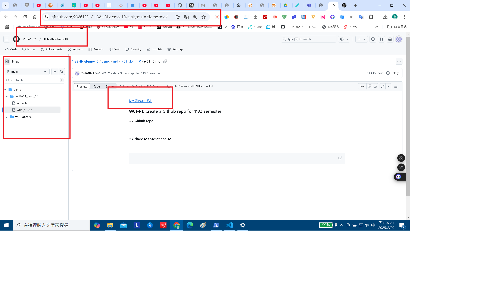
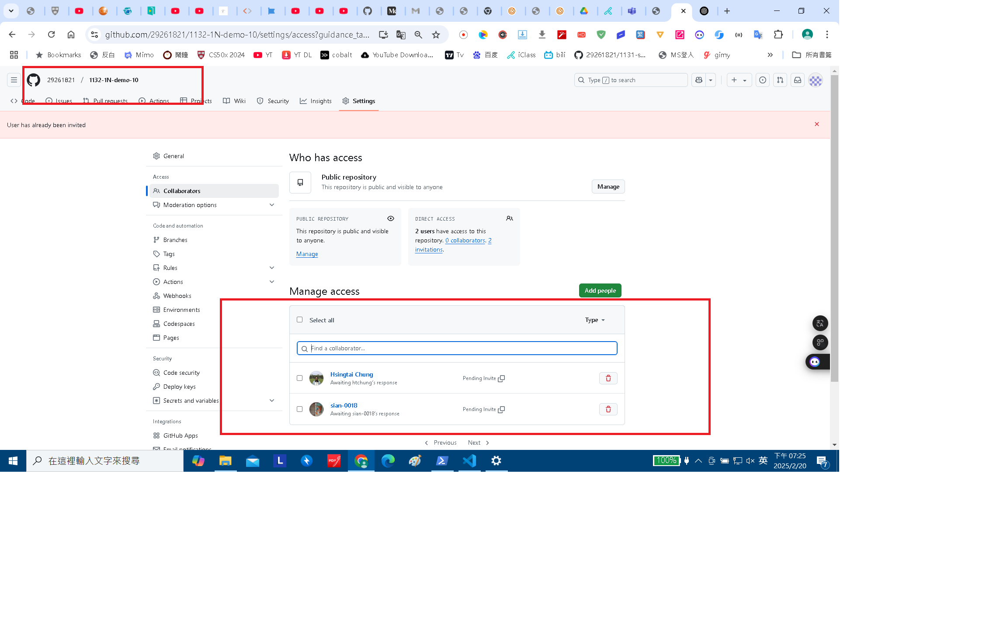
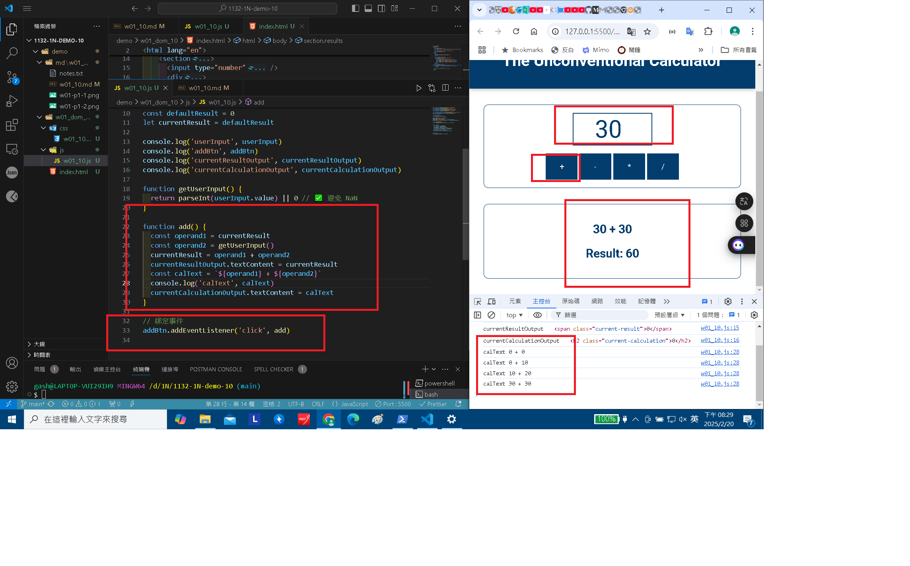
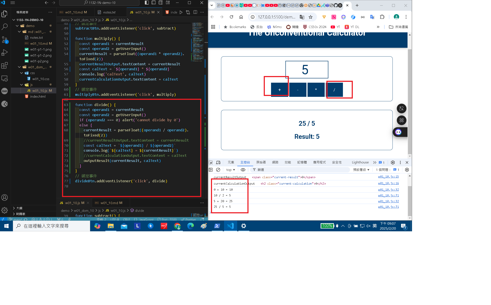
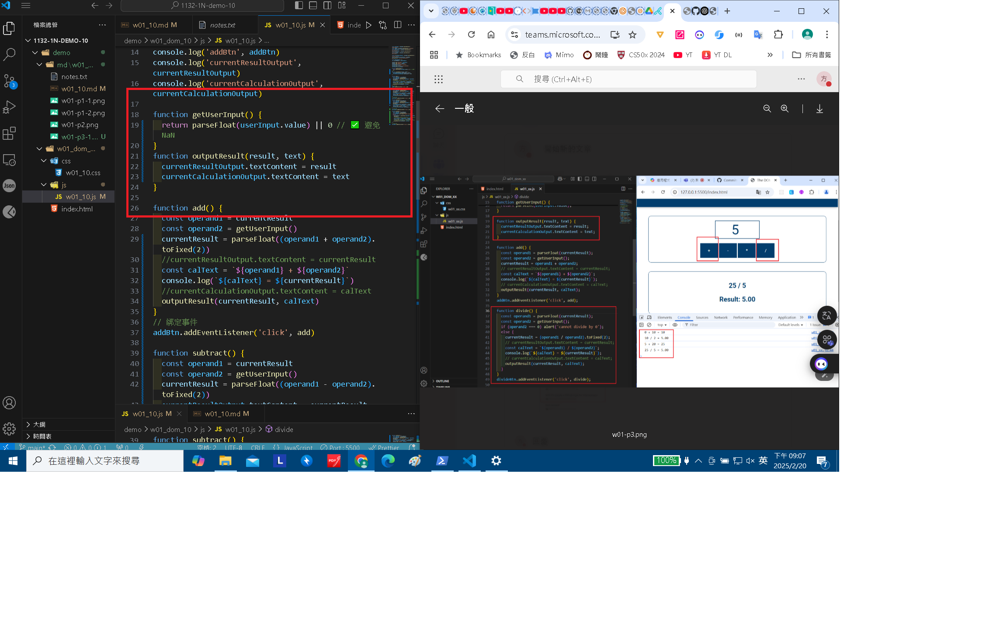
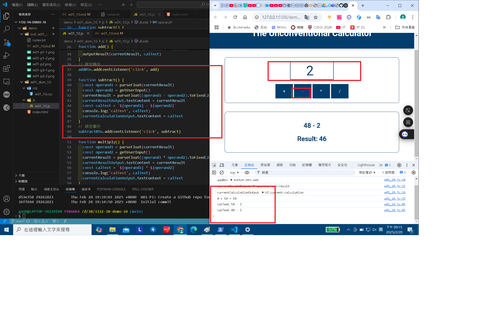
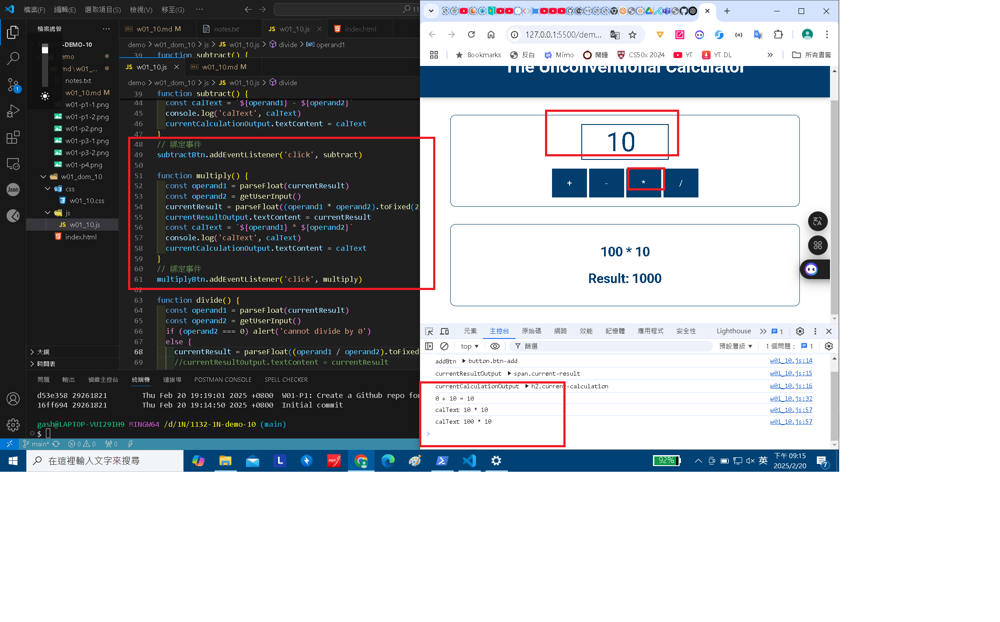
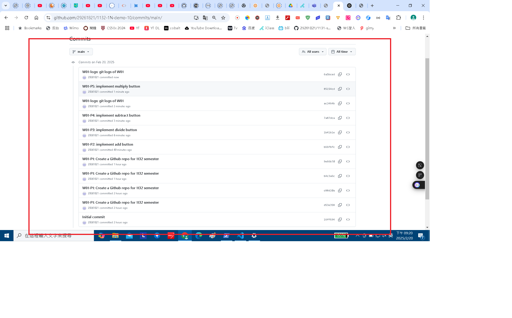

[My Github URL](https://github.com/29261821/1132-1N-demo-10)

### W01-P1: Create a Github repo for 1132 semester

#### => Github repo



#### => share to teacher and TA



```
b4c3a6c 29261821        Thu Feb 20 19:25:30 2025 +0800  W01-P1: Create a Github repo for 1132 semester
```

### W01-P2: implement add button



```
b66fbfc 29261821        Thu Feb 20 20:30:48 2025 +0800  W01-P2: implement add button
```

### : W01-P3: implement divide button





```
1b41b1e 29261821        Thu Feb 20 21:14:07 2025 +0800  W01-P3: implement divide button
```

### W01-P4: implement subtract button



```
7a87dca 29261821        Thu Feb 20 21:16:34 2025 +0800  W01-P4: implement subtract button
```

### W01-P5: implement multiply button



```

```

### W01-logs: git logs of W01


