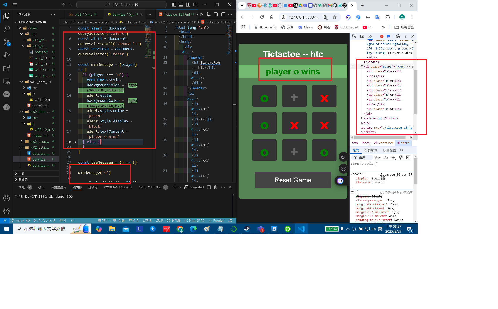
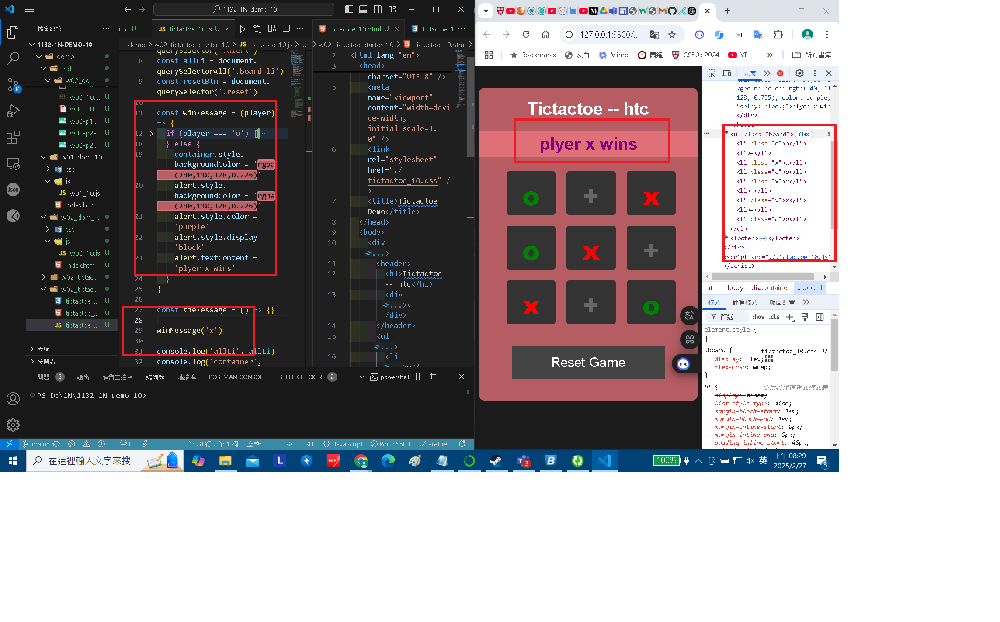
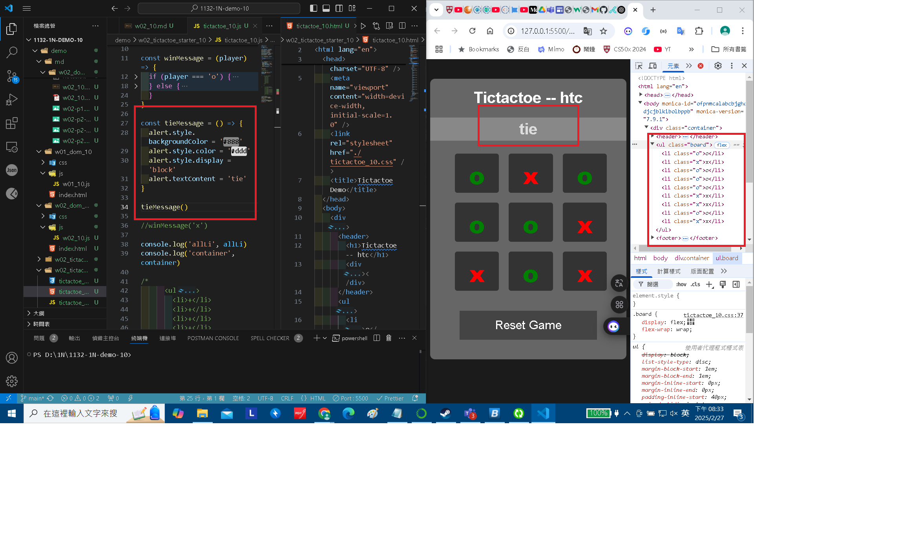
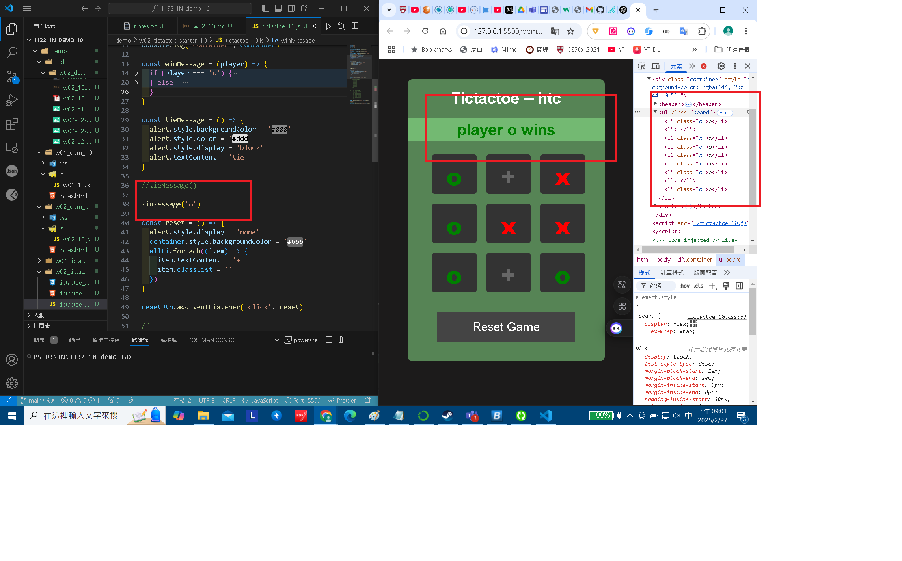
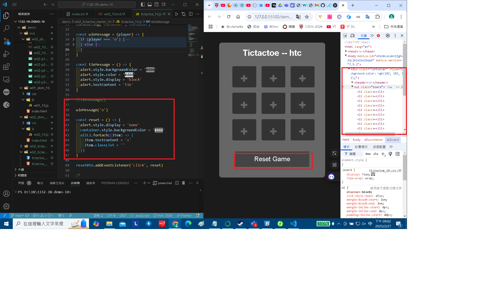
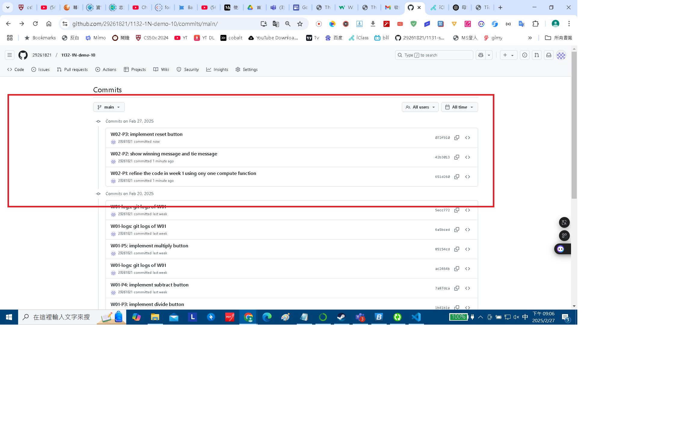

[My Github URL](https://github.com/29261821/1132-1N-demo-10)

### W02-P1: refine the code in week 1 using ony one compute function


```
b4c3a6c 29261821        Thu Feb 20 19:25:30 2025 +0800  W02-P1: Create a Github repo for 1132 semester
```

### W02-P2: show winning message and tie message

#### ==> play o wins



#### ==> play x wins



#### ==> tie



```
84280a8 htchung Thu Feb 27 20:23:14 2025 +0800  W02-P2: show winning message and tie message
```

W02-P3: implement reset button

#### ==> initially player o win



#### ==> after reset button is pressed



```
3ae5259 htchung Thu Feb 27 20:55:48 2025 +0800  W02-P3: implement reset button
```

### W02-logs: git logs of W02



```
85154cd 29261821        Thu Feb 20 21:18:49 2025 +0800  W02-P5: implement multiply button
```
