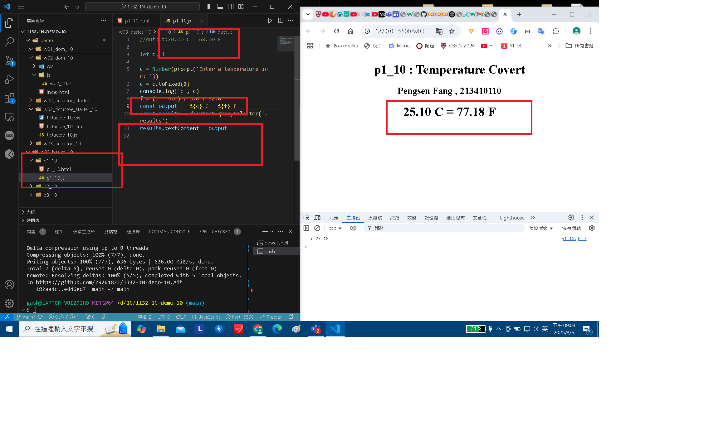
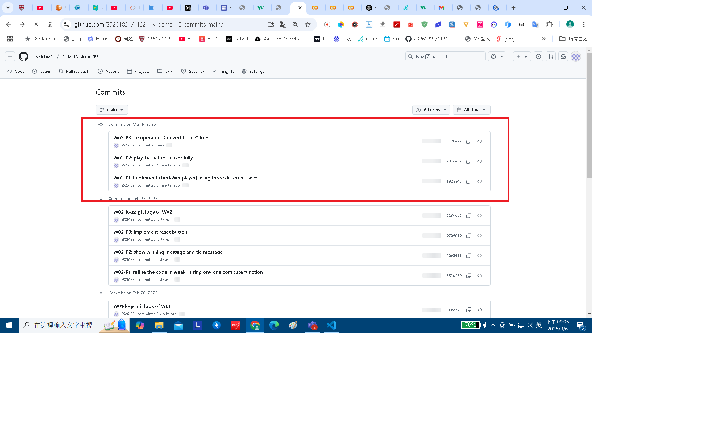

[My Github URL](https://github.com/29261821/1132-1N-demo-10)

### W03-P1: Implement checkWin(player) using three different cases

#### => player o wins


#### => player x wins


#### => no player wins


```
182aa4c 29261821        Thu Mar 6 21:00:55 2025 +0800   W03-P1: Implement checkWin(player) using three different cases
```

### W03-P2: play TicTacToe successfully

#### => player o wins


#### => player x wins


#### => tie


```
ed46ed7 29261821        Thu Mar 6 21:01:39 2025 +0800   W03-P2: play TicTacToe successfully
```

### W03-P3: Temperature Convert from C to F



```
cc7beee 29261821        Thu Mar 6 21:05:48 2025 +0800   W03-P3: Temperature Convert from C to F
```

### W03-logs: git logs of W03



```
bfd4512 29261821        Thu Mar 6 21:07:15 2025 +0800   W03-logs: git logs of W03
```
