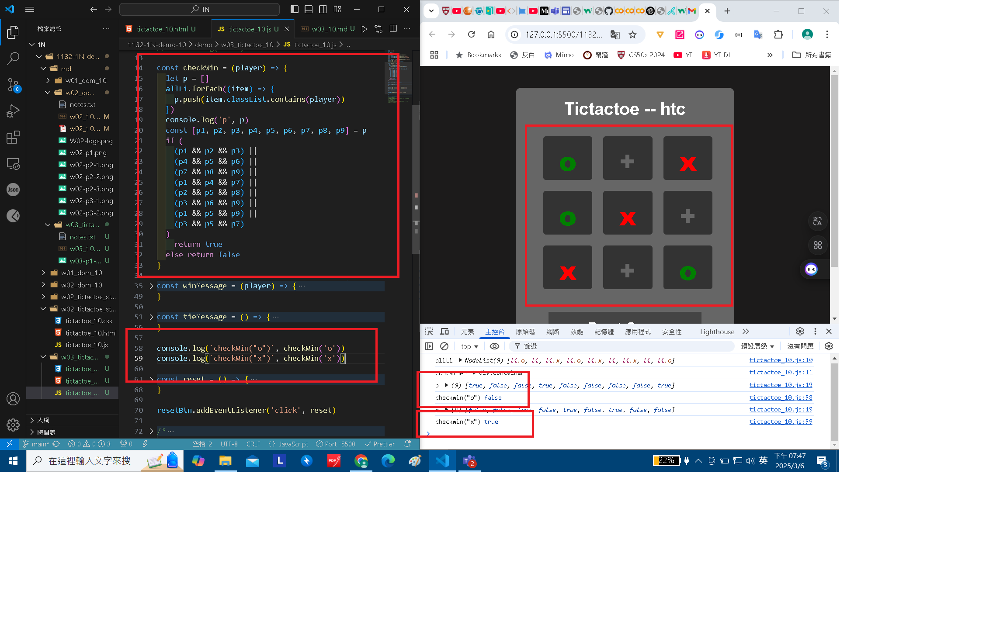
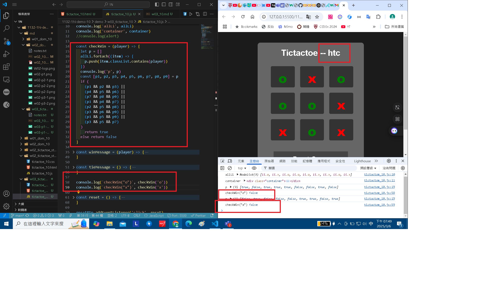
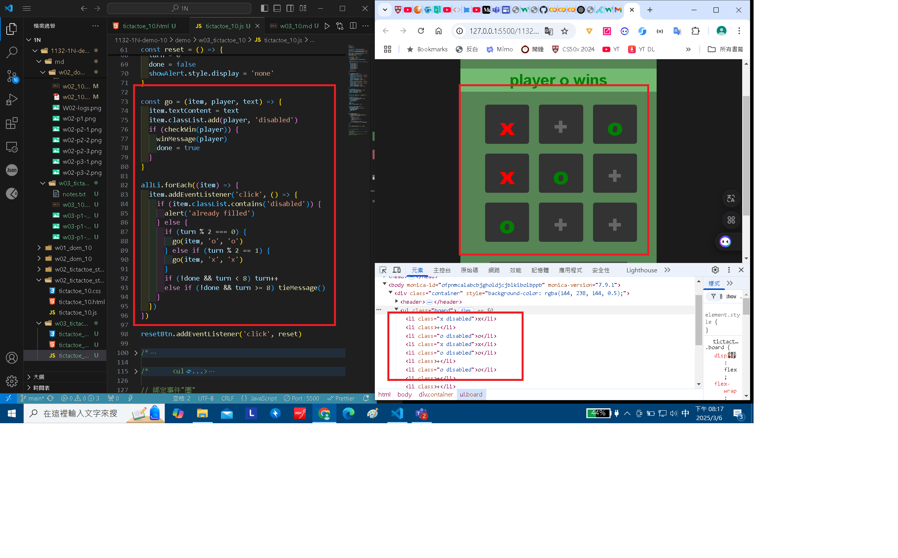
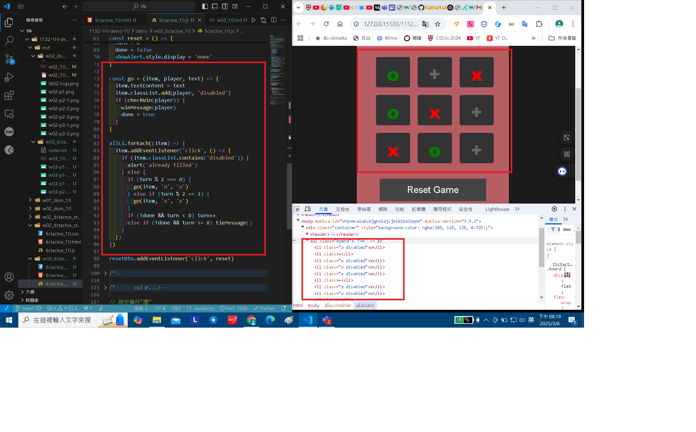
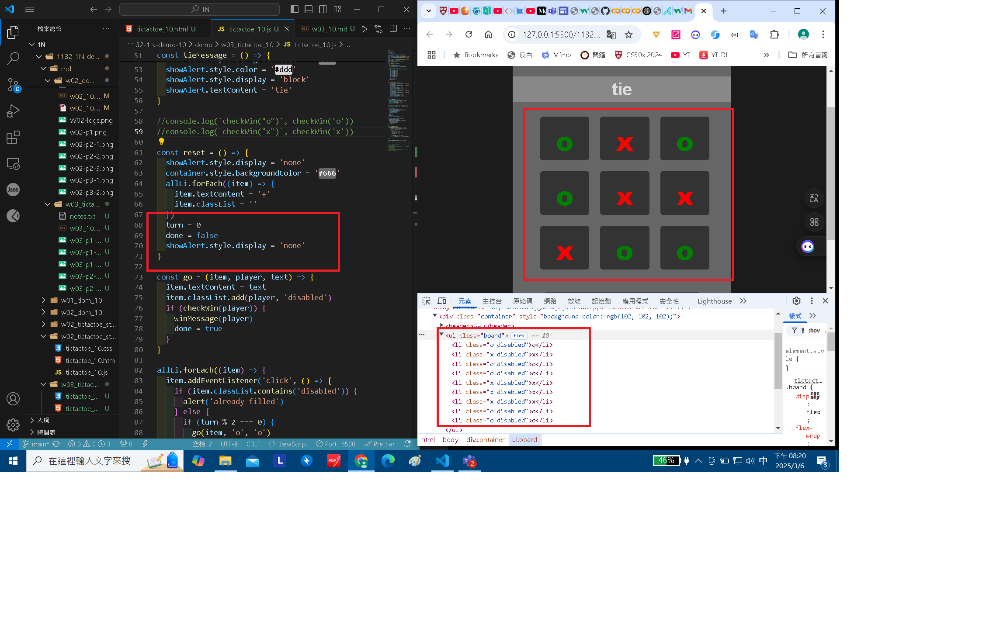

### W03-P1: Implement checkWin(player) using three different cases

#### => player o wins


#### => player x wins



#### => no player wins



```
fbff5c2 htchung Thu Mar 6 19:12:19 2025 +0800   W03-P1: Implement checkWin(player) using three different cases
```

### W03-P2: play TicTacToe successfully

#### => player o wins



#### => player x wins



#### => tie



```
cc1d356 htchung Thu Mar 6 20:08:15 2025 +0800   W03-P2: play TicTacToe successfully
```

### W03-logs: git logs of W03


```
82fdcd6 29261821        Thu Feb 27 21:07:16 2025 +0800  W02-logs: git logs of W02
```
