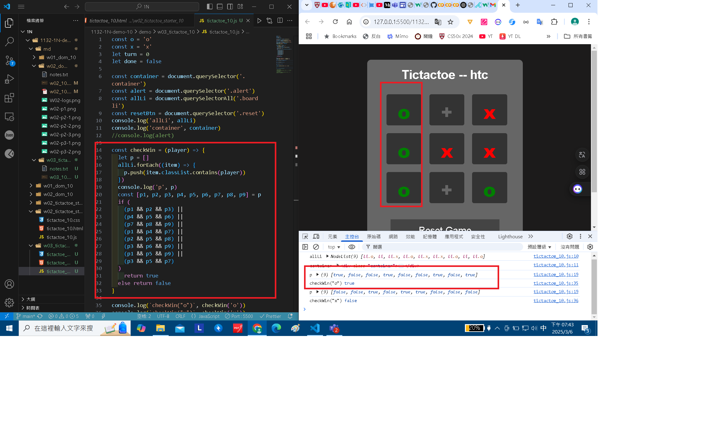

### W03-P1: Implement checkWin(player) using three different cases

#### => player o wins



#### => player x wins


#### => no player wins


```
fbff5c2 htchung Thu Mar 6 19:12:19 2025 +0800   W03-P1: Implement checkWin(player) using three different cases
```

### W03-P2: play TicTacToe successfully

#### => player o wins


#### => player x wins


#### => tie


```
cc1d356 htchung Thu Mar 6 20:08:15 2025 +0800   W03-P2: play TicTacToe successfully
```

### W03-P3: Temperature Convert from C to F


```
d2e7c01 htchung Thu Mar 6 20:59:34 2025 +0800   W03-P3: Temperature Convert from C to F
```

### W03-logs: git logs of W03


```
82fdcd6 29261821        Thu Feb 27 21:07:16 2025 +0800  W02-logs: git logs of W02
```
