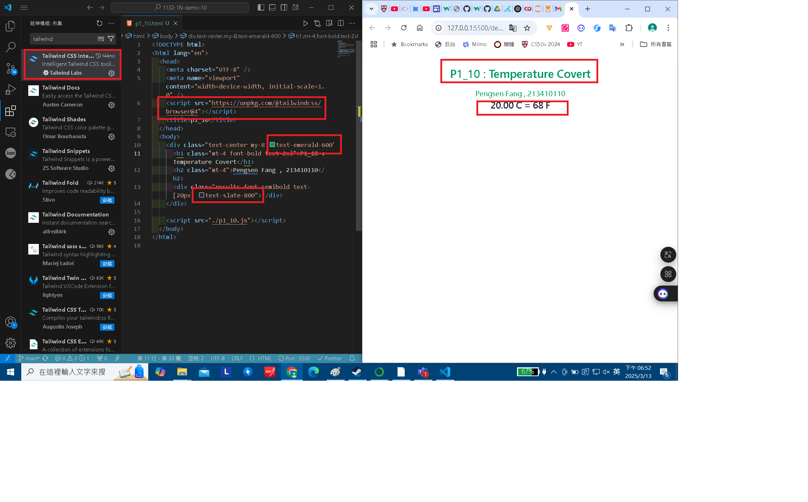
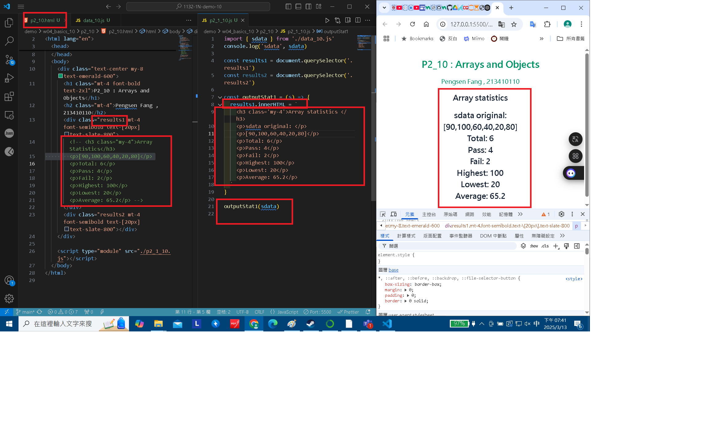
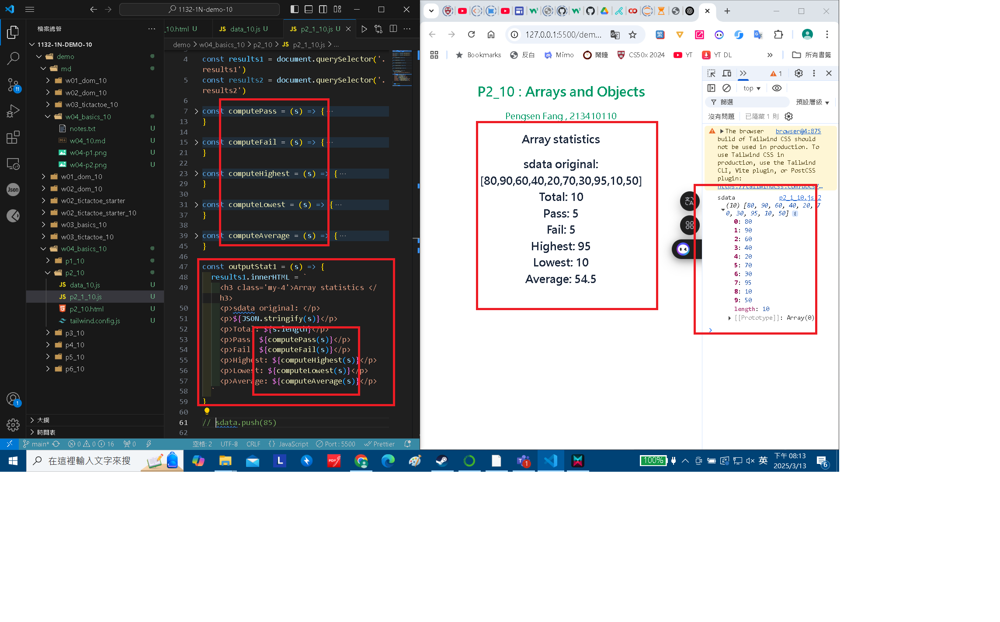
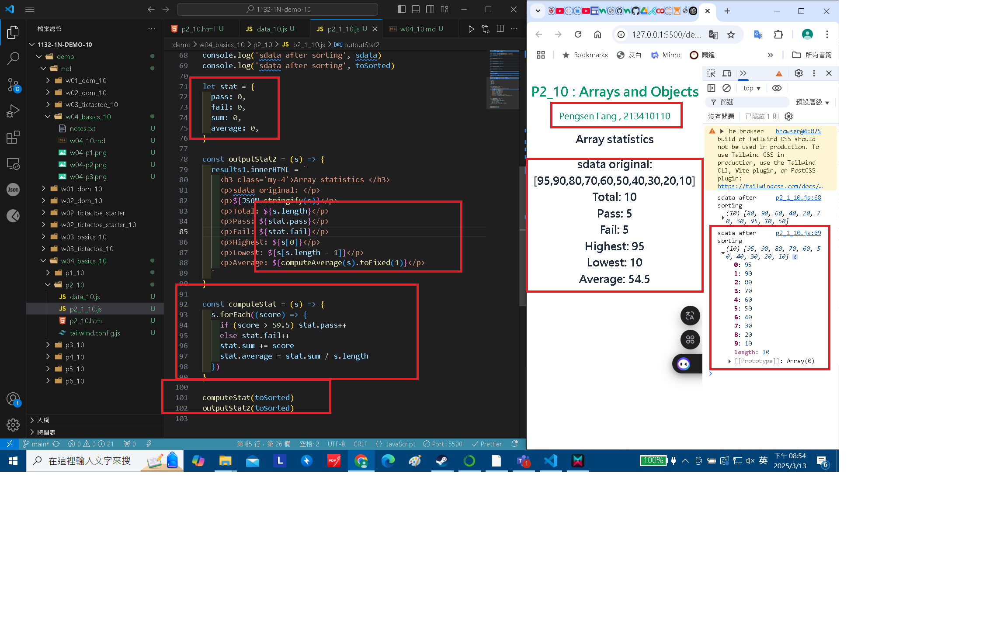
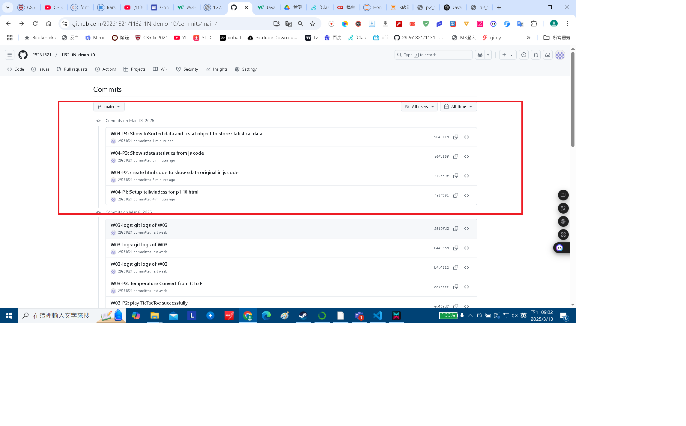

[My Github URL](https://github.com/29261821/1132-1N-demo-10)

### W04-P1: Setup tailwindcss for p1_10.html



```
fa8f581 29261821        Thu Mar 13 20:57:33 2025 +0800  W04-P1: Setup tailwindcss for p1_10.html
```

### W04-P2: create html code to show sdata original in js code



```
319ab9c 29261821        Thu Mar 13 20:58:26 2025 +0800  W04-P2: create html code to show sdata original in js code
```

### W04-P3: Show sdata statistics from js code



```
a6fb93f 29261821        Thu Mar 13 20:59:20 2025 +0800  W04-P3: Show sdata statistics from js code
```

### W04-P4: Show toSorted data and a stat object to store statistical data



```
9846f1d 29261821        Thu Mar 13 21:01:07 2025 +0800  W04-P4: Show toSorted data and a stat object to store statistical data
```

### W04-logs: git logs of W04



```
af74585 29261821        Thu Mar 13 21:04:17 2025 +0800  W04-logs: git logs of W04
```
