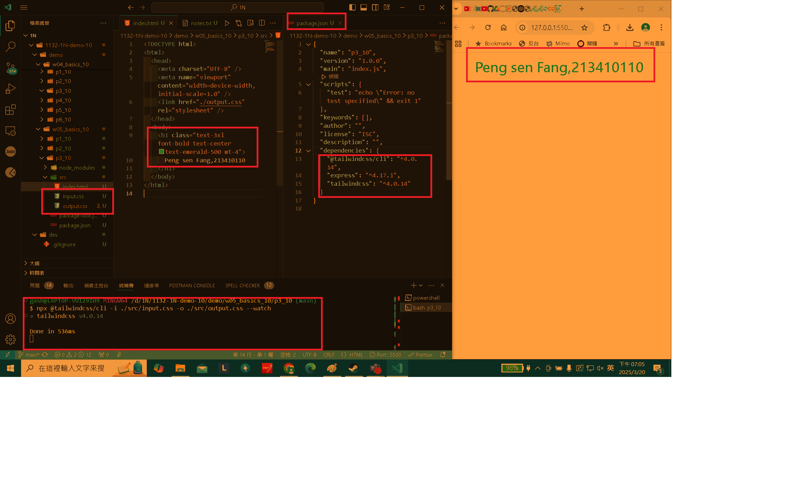
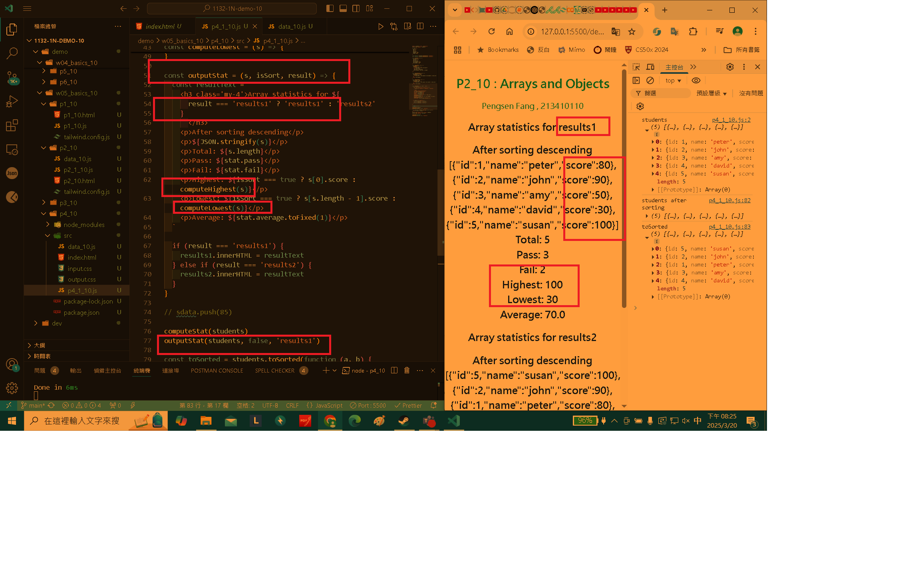
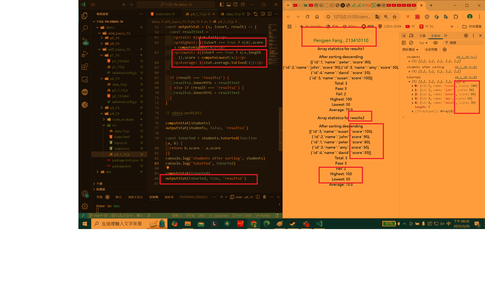
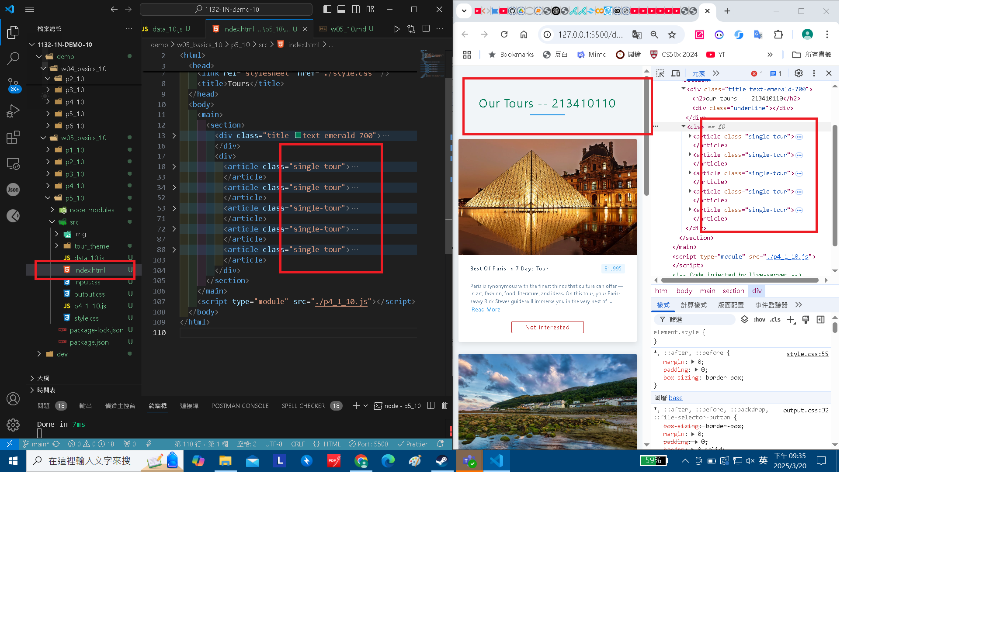
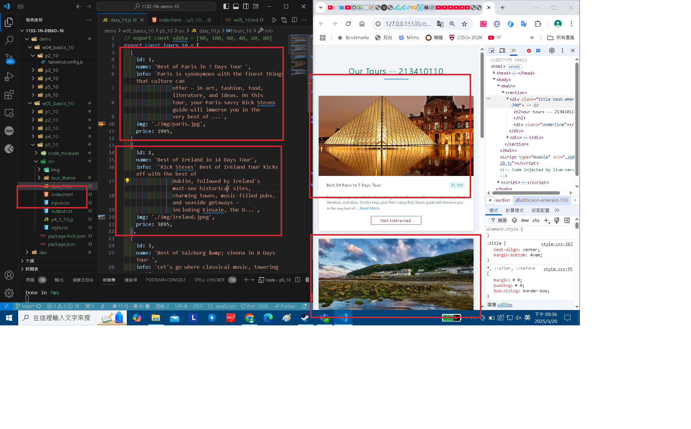
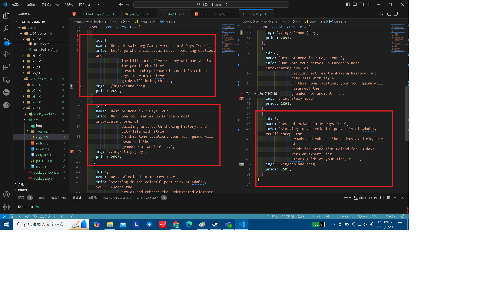
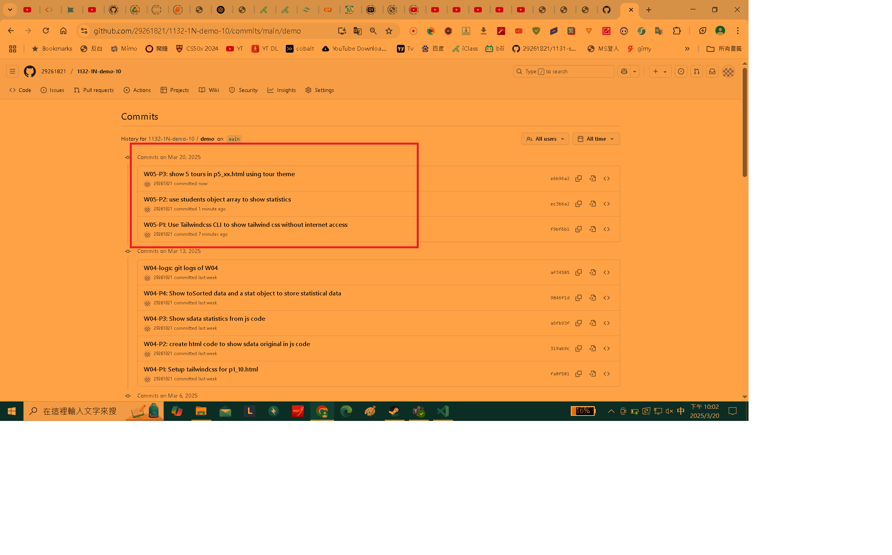

[My Github URL](https://github.com/29261821/1132-1N-demo-10)

### W05-P1: Use Tailwindcss CLI to show tailwind css without internet access



```
f9bf6b1 29261821        Thu Mar 20 21:55:43 2025 +0800  W05-P1: Use Tailwindcss CLI to show tailwind css without internet access
```

### W05-P2: use students object array to show statistics

#### => no sorting, show in result1 section



#### => after sorting, show in result2 section



```
8ff3ab5 htchung Thu Mar 20 20:03:50 2025 +0800  W05-P2: use students object array to show statistics
```

### W05-P3: show 5 tours in p5_xx.html using tour theme

#### => display 5 tours in tour theme, make tailwind css work as well



#### => use array tours_xx to store all data of 5 tours





```
7e55db htchung Thu Mar 20 20:59:10 2025 +0800  W05-P3: show 5 tours in p5_xx.html using tour theme
```

### W05-logs: git logs of W05



```
af74585 29261821        Thu Mar 13 21:04:17 2025 +0800  W04-logs: git logs of W04
```
