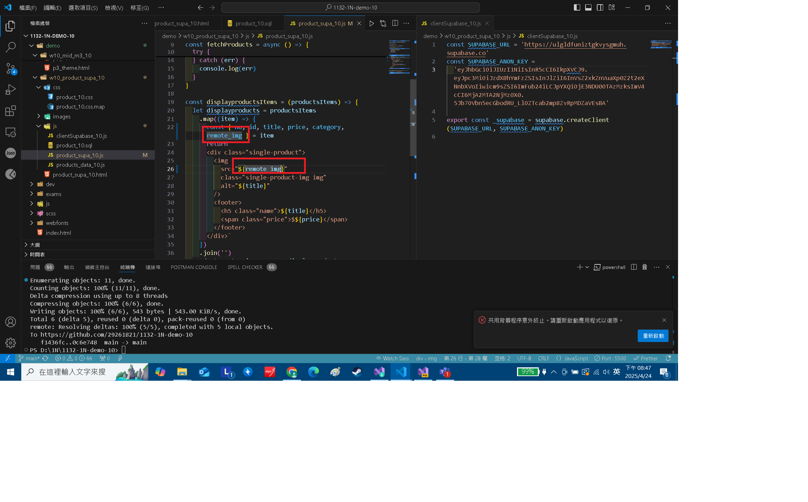

[Github URL](https://github.com/29261821/1132-1N-demo-10)

[vercel URL](https://1132-1-n-demo-10.vercel.app/)

### W10-P1: Copy mid1 m3_10 answer and rearrange it for W10 demo


```
0c4c161 29261821        Thu Apr 24 20:27:45 2025 +0800  W10-P1: Copy mid1 m3_10 answer and rearrange it for W10 demo
```

### W10-P2: Setup Supabase with project yourcode_1n_10

#### => show product_10 table with 3 data


#### => show SQL to create product_10 table and insert three data


#### => show Project URL and ANON KEY for this project


```
f1436fc 29261821        Thu Apr 24 20:28:22 2025 +0800  W10-P2: Setup Supabase with project yourcode_1n_10
```

### W10-P3: Get 12 products from Supabase

#### => show how to fetch products from Supabase


#### => Show how to get supabase-js to create supabase client


```
0c6e748 29261821        Thu Apr 24 20:35:53 2025 +0800  W10-P3: Get 12 products from Supabase
```

### W10-P4: Upload 12 images to Supabase storage and show these remote images

#### => show the first two images are from Supabase storage


#### => show remote_img in product_xx table


#### => show the js code to use remote_img instead of img



```
8fe5317 29261821        Thu Apr 24 20:48:22 2025 +0800  W10-P4: Upload 12 images to Supabase storage and show these remote images
```

### W10-logs: git logs of W10


```
d70cc04 29261821        Thu Apr 24 20:49:04 2025 +0800  W10-logs: git logs of W10
```
