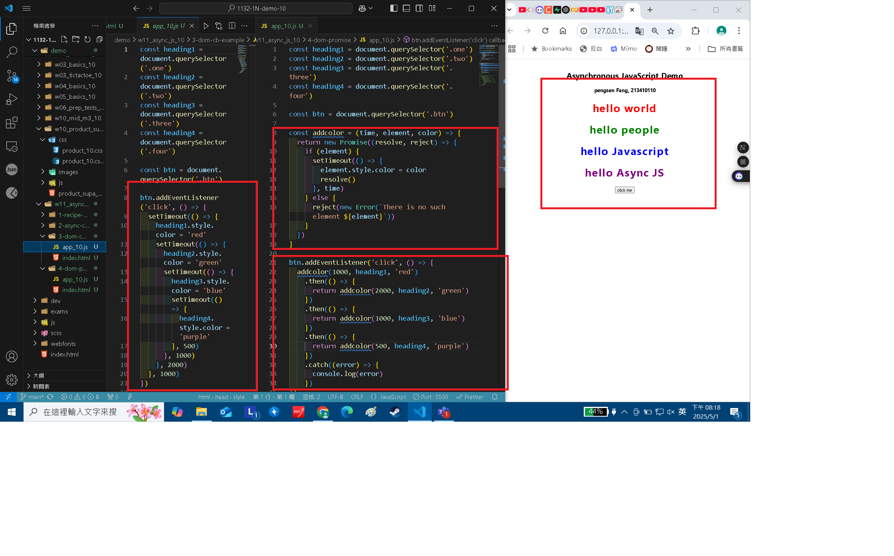

[Github URL](https://github.com/29261821/1132-1N-demo-pengsenFang-10)

[vercel URL](https://1132-1n-demo-pengsenfang-10.vercel.app/)

### W11-P1: Synchronous vs. Asynchronous

#### => Synchronous demo


#### => Asynchronous demo


```
f0aa012 29261821        Thu May 1 20:37:36 2025 +0800   W11-P1: Synchronous vs. Asynchronous
```

### W11-P2: Asynchronous DOM demo


```
3fb6cfb 29261821        Thu May 1 20:38:15 2025 +0800   W11-P2: Asynchronous DOM demo
```

### W11-P3: Use Promise to do W11-P2



```
ab73ad1 29261821        Thu May 1 20:38:46 2025 +0800   W11-P3: Use Promise to do W11-P2
```

### W11-P4: Use Async Await to do W11-P3


```
127e12b 29261821        Thu May 1 20:44:30 2025 +0800   W11-P4: Use Async Await to do W11-P3
```

### W11-P5: Change Github repo name, and Vercel URL

#### => Github


#### => Vercel


```
1bc37a0 29261821        Thu May 1 20:58:12 2025 +0800   W11-P5: Change Github repo name, and Vercel URL
```

### W11-logs: git logs of W11


```
5558cde 29261821        Thu May 1 20:58:47 2025 +0800   W11-logs: git logs of W11
```
