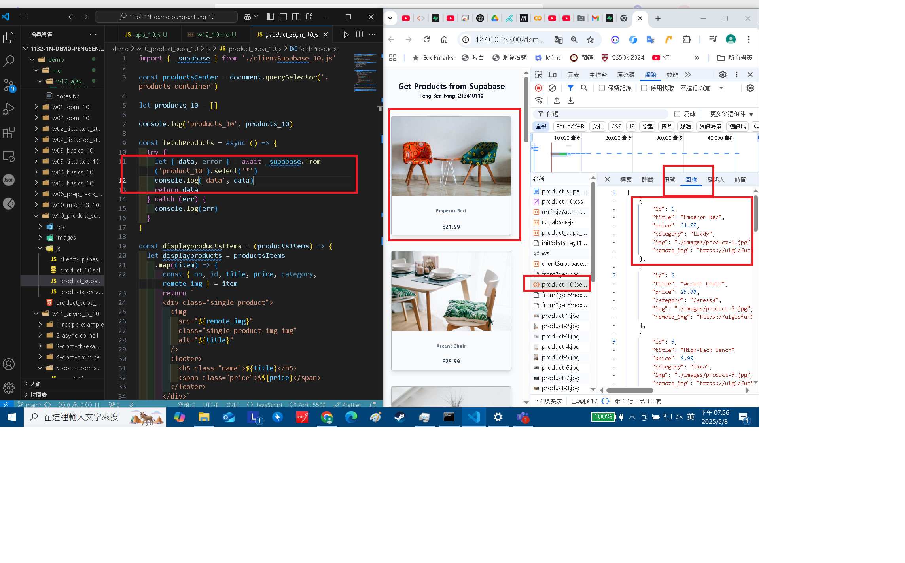

[Github URL](https://github.com/29261821/1132-1N-demo-pengsenFang-10)

[vercel URL](https://1132-1n-demo-pengsenfang-10.vercel.app/)

### W12-P1: use xhr to display a simple text


```
0cd212e 29261821        Thu May 8 20:02:53 2025 +0800   W12-P1: use xhr to display a simple text
```

### W12-P2: click a button to fetch data


```
4d0e4e4 29261821        Thu May 8 20:03:24 2025 +0800   W12-P2: click a button to fetch data
```

### W12-P3: Run w10_product_supa_xx, see how it works

#### => \_supabase.from('product_xx').select('\*');


#### => check response



#### => check how many http requests being done in fetchProducts


```
3191cc7 29261821        Thu May 8 20:03:48 2025 +0800   W12-P3: Run w10_product_supa_xx, see how it works
```

### W12-P4: Fetch person.json string and display name in the browser

#### => use JSON.parse() to convert responseText to JSON array


#### => extract name from data and show it in the browser


#### => check the Network, http response


```
b662295 29261821        Thu May 8 20:45:21 2025 +0800   W12-P4: Fetch person.json string and display name in the browser
```

### W12-logs: git logs of W12


```
cdf9e8d 29261821        Thu May 8 20:46:38 2025 +0800   W12-logs: git logs of W12
```
