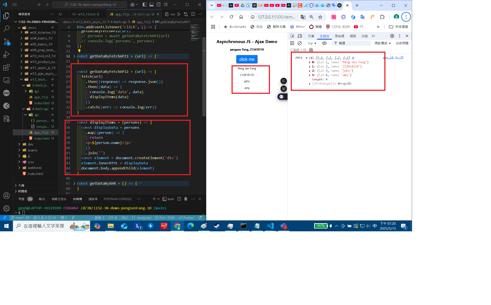
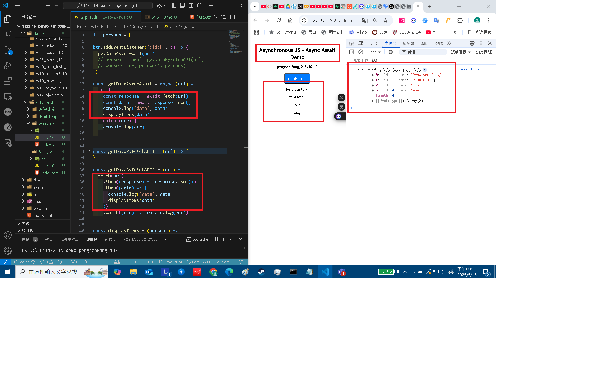
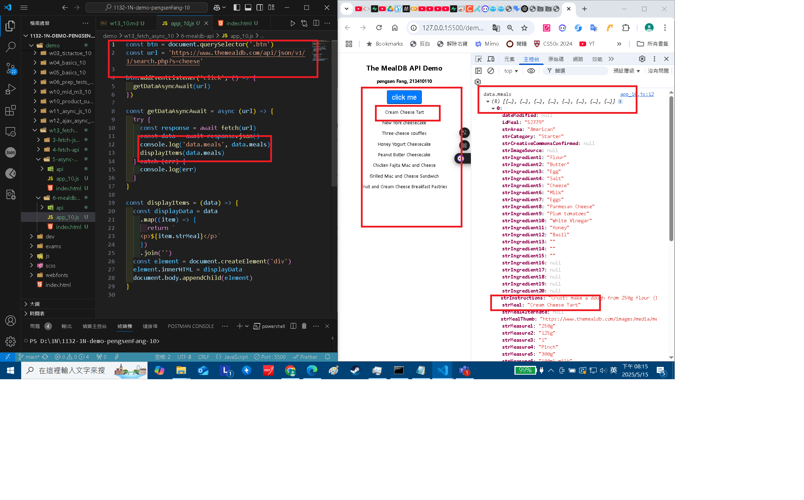
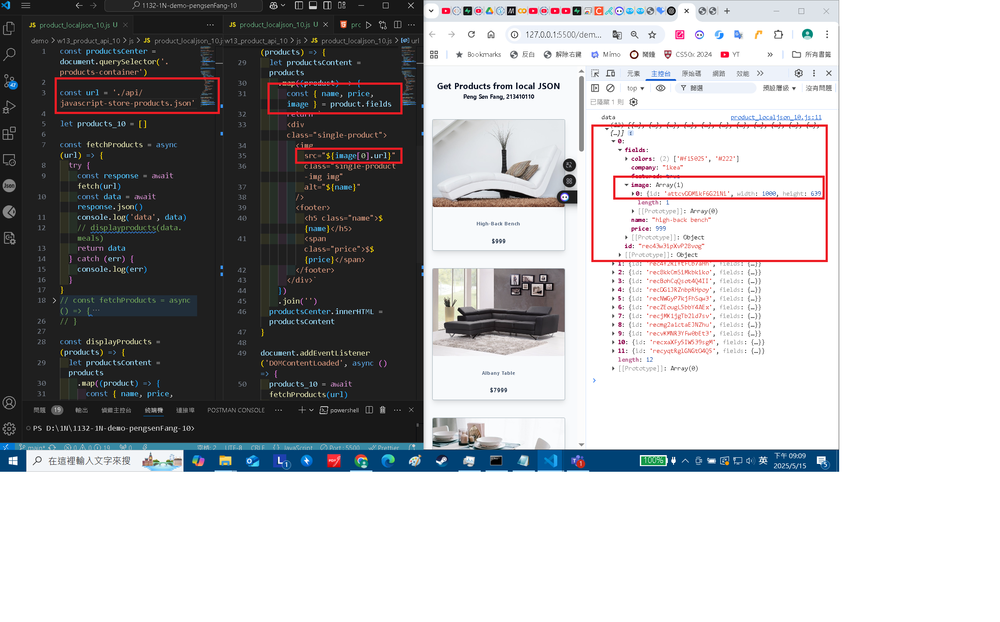
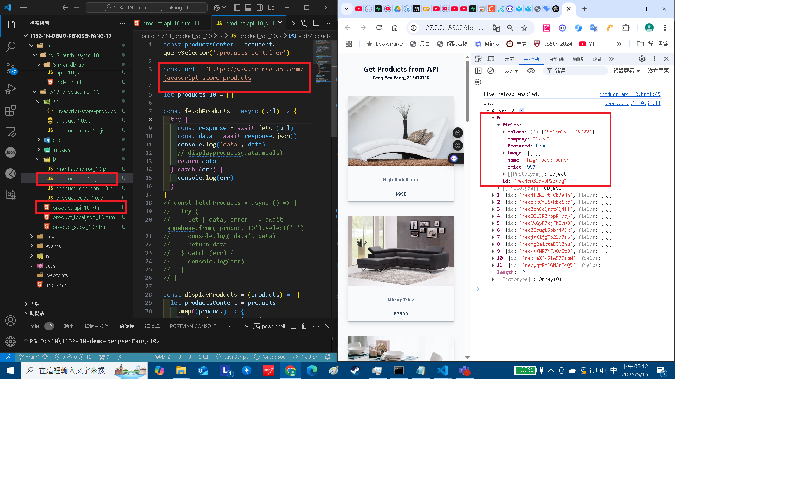
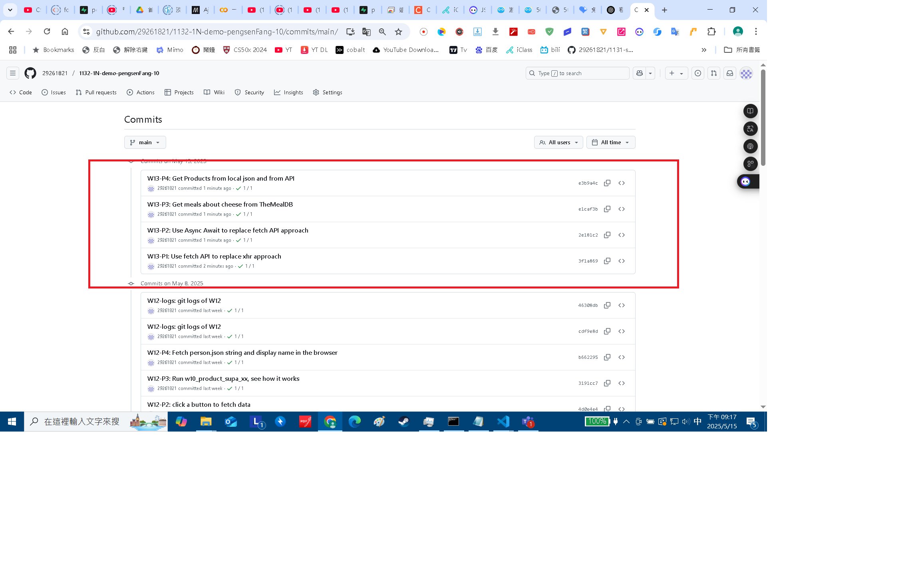

[Github URL](https://github.com/29261821/1132-1N-demo-pengsenFang-10)

[vercel URL](https://1132-1n-demo-pengsenfang-10.vercel.app/)

### W13-P1: Use fetch API to replace xhr approach



```
3f1a869 29261821        Thu May 15 21:15:02 2025 +0800  W13-P1: Use fetch API to replace xhr approach
```

### W13-P2: Use Async Await to replace fetch API approach



```
2e181c2 29261821        Thu May 15 21:15:35 2025 +0800  W13-P2: Use Async Await to replace fetch API approach
```

### W13-P3: Get meals about cheese from TheMealDB



```
e1caf3b 29261821        Thu May 15 21:15:59 2025 +0800  W13-P3: Get meals about cheese from TheMealDB
```

### W13-P4: Get Products from local json and from API

#### => Get products from local json



#### => Get products from API



```
e3b9a4c 29261821        Thu May 15 21:16:24 2025 +0800  W13-P4: Get Products from local json and from API
```

### W13-P4: Get Products from local json and from API

#### => Get products from local json


#### => Get products from API


```
91ef277 htchung Thu May 15 20:59:42 2025 +0800  W13-P4: Get Products from local json and from API
```

### W13-logs: git logs of W13



```
20cea95 29261821        Thu May 15 21:19:18 2025 +0800  W13-logs: git logs of W13
```
