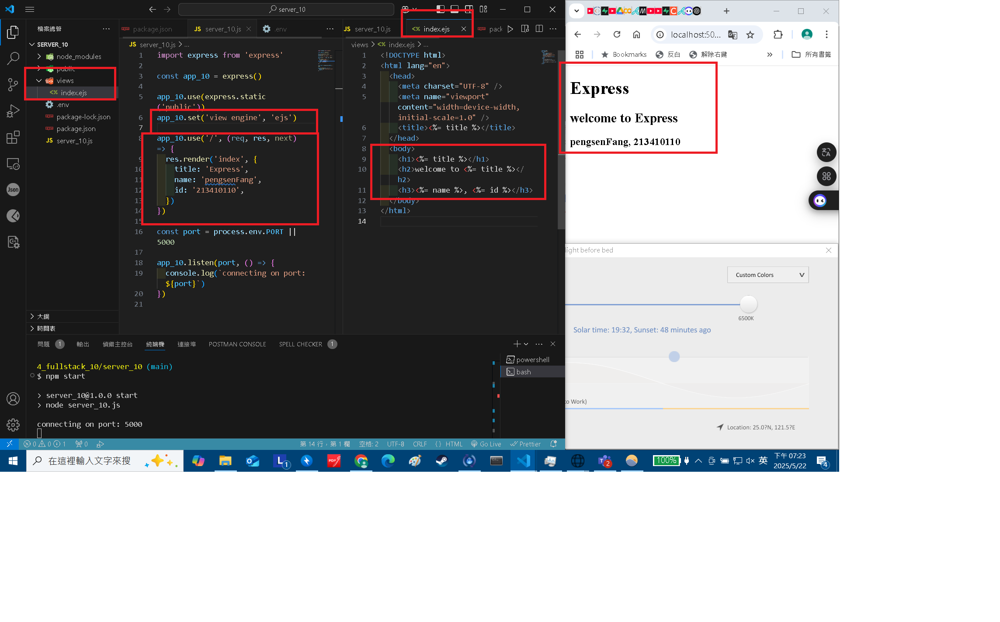
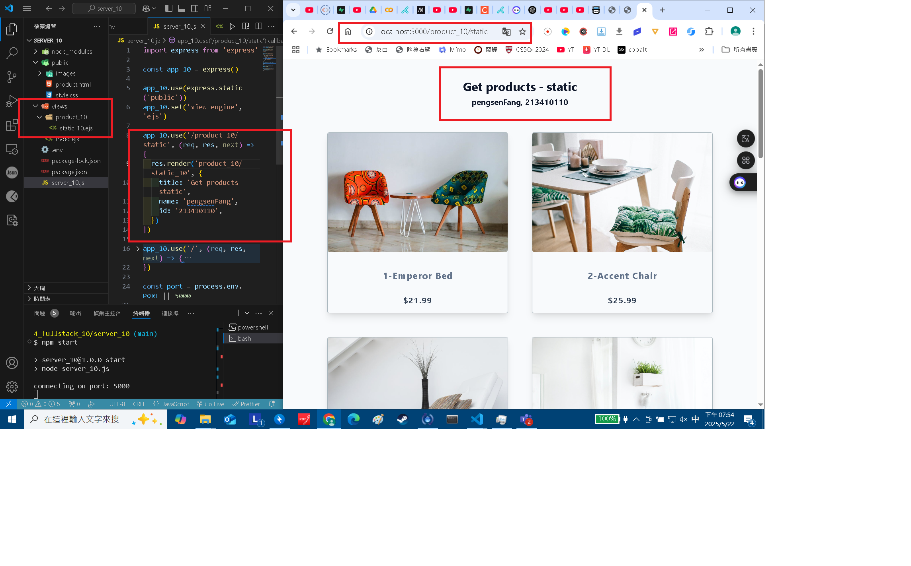
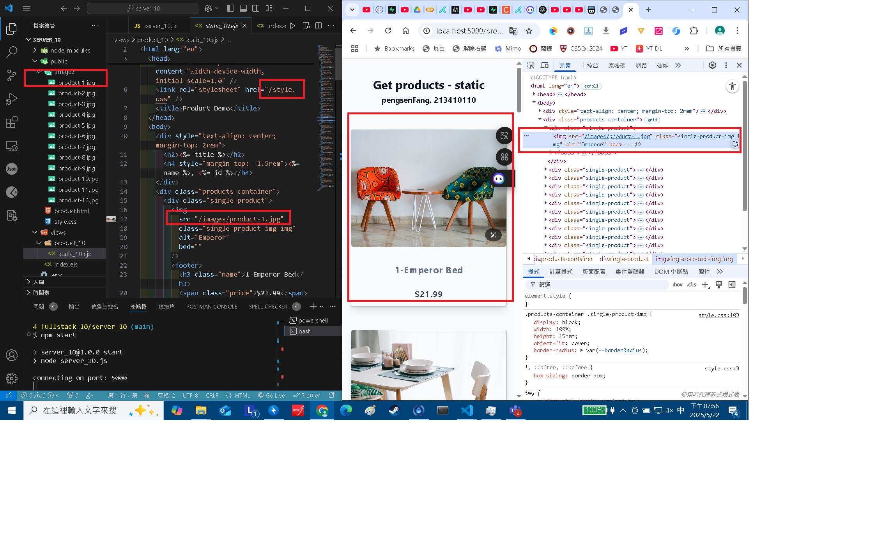
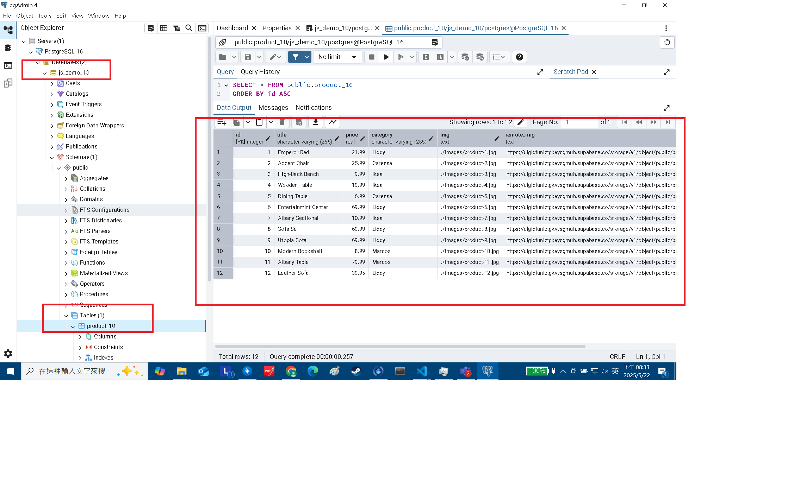
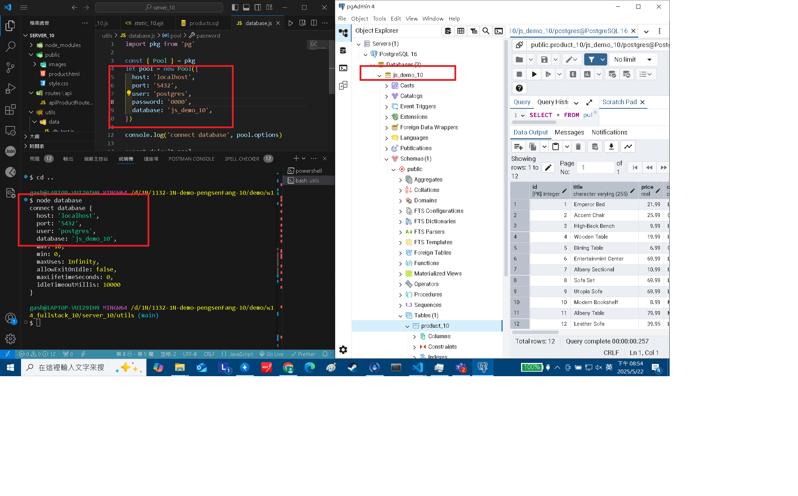
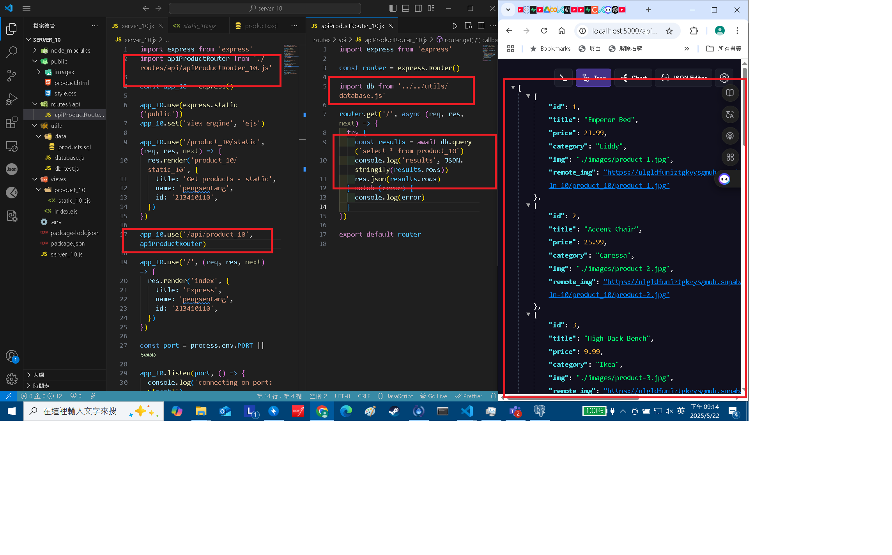
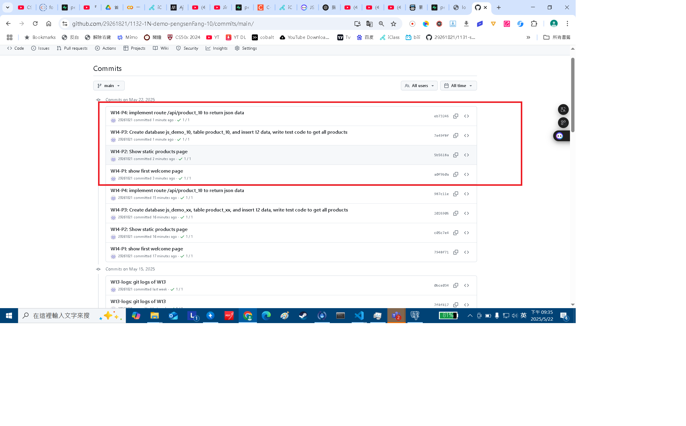

[Github URL](https://github.com/29261821/1132-1N-demo-pengsenFang-10)

[vercel URL](https://1132-1n-demo-pengsenfang-10.vercel.app/)

### W14-P1: show first welcome page



```
fa2a1a5 htchung Thu May 22 19:16:00 2025 +0800  W14-P1: show first welcome page
```

### W14-P2: Show static products page

#### => show render page with data passed into ejs page



#### => show how the product-1.jpg can be accessed fro public directory as root directory



```
3528400 htchung Thu May 22 19:47:08 2025 +0800  W14-P2: Show static products page
```

### W14-P3: Create database js_demo_10, table product_10, and insert 12 data, write test code to get all products

#### => Create database js_demo_10, table product_10, and insert 12 data



#### => connect js_demo_10 database



#### => get all product data


```
770039a htchung Thu May 22 20:30:44 2025 +0800  W14-P3: Create database js_demo_10, table product_10, and insert 12 data, write test code to get all products
```

### W14-P4: implement route /api/product_10 to return json data



#### =>


```
c4286e2 htchung Thu May 22 21:00:13 2025 +0800  W14-P4: implement route /api/product_10 to return json data
```

### W14-logs: git logs of W14



```
20cea95 29261821        Thu May 15 21:19:18 2025 +0800  W13-logs: git logs of W13
```
