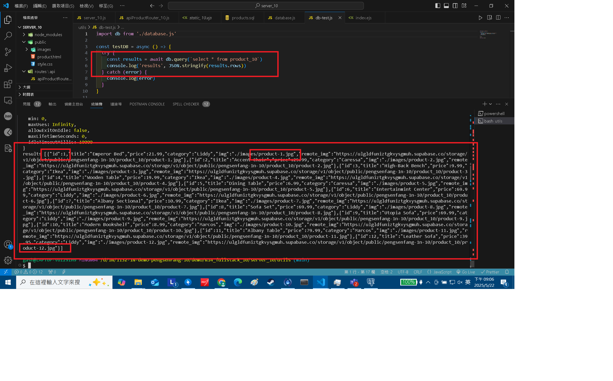

[Github URL](https://github.com/29261821/1132-1N-demo-pengsenFang-10)

[vercel URL](https://1132-1n-demo-pengsenfang-10.vercel.app/)

### W14-P1: show first welcome page


```
a0f9b0a 29261821        Thu May 22 21:31:31 2025 +0800  W14-P1: show first welcome page
```

### W14-P2: Show static products page

#### => show render page with data passed into ejs page


#### => show how the product-1.jpg can be accessed fro public directory as root directory


```
5b5618a 29261821        Thu May 22 21:32:56 2025 +0800  W14-P2: Show static products page
```

### W14-P3: Create database js_demo_10, table product_10, and insert 12 data, write test code to get all products

#### => Create database js_demo_10, table product_10, and insert 12 data


#### => connect js_demo_10 database


#### => get all product data



```
7e49f8f 29261821        Thu May 22 21:33:32 2025 +0800  W14-P3: Create database js_demo_10, table product_10, and insert 12 data, write test code to get all products
```

### W14-P4: implement route /api/product_10 to return json data


#### =>


```
eb73246 29261821        Thu May 22 21:34:05 2025 +0800  W14-P4: implement route /api/product_10 to return json data
```

### W14-logs: git logs of W14


```
ed978bb 29261821        Thu May 22 21:37:28 2025 +0800  W14-logs: git logs of W14
```
