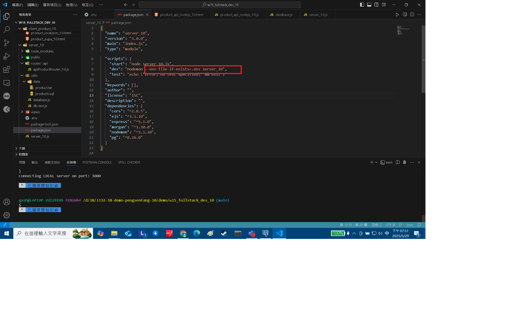
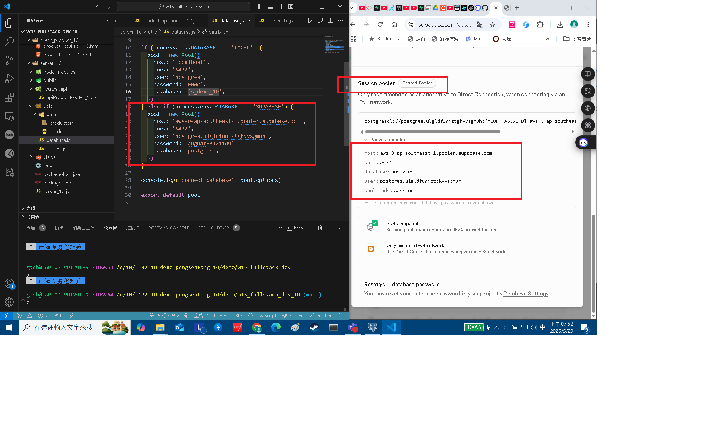
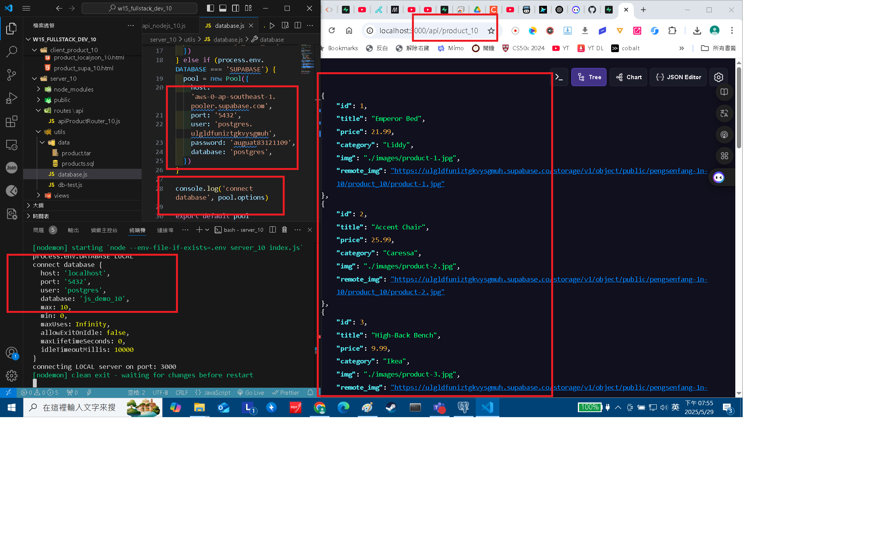
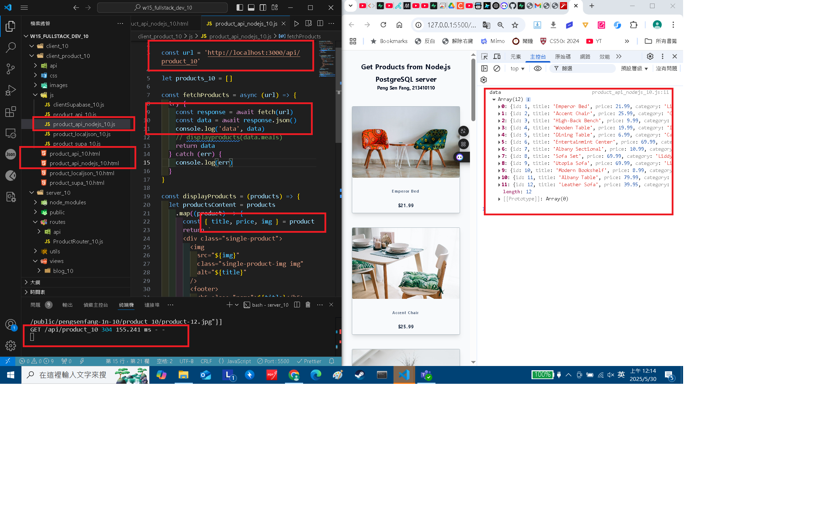
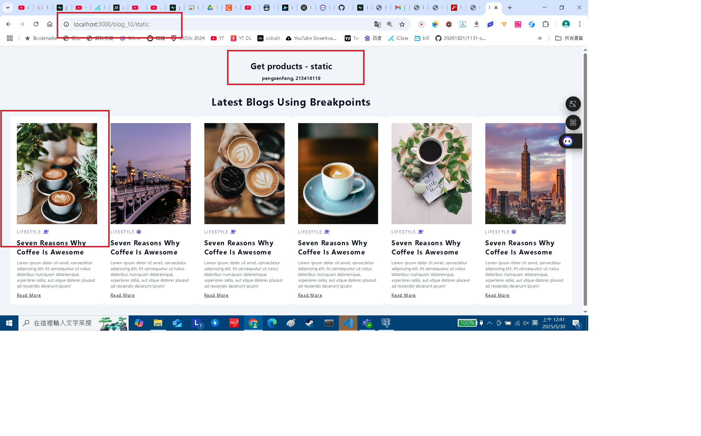
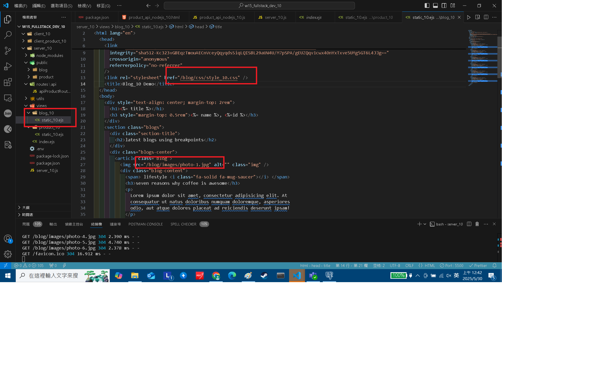
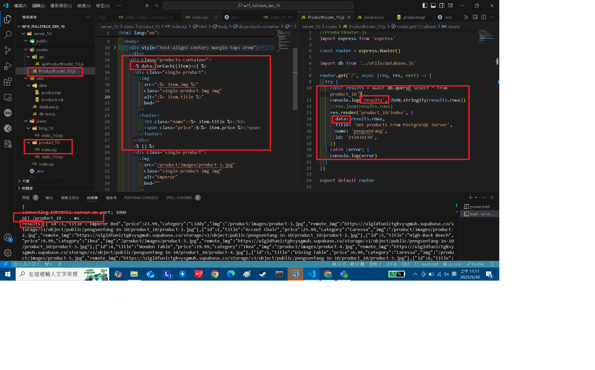
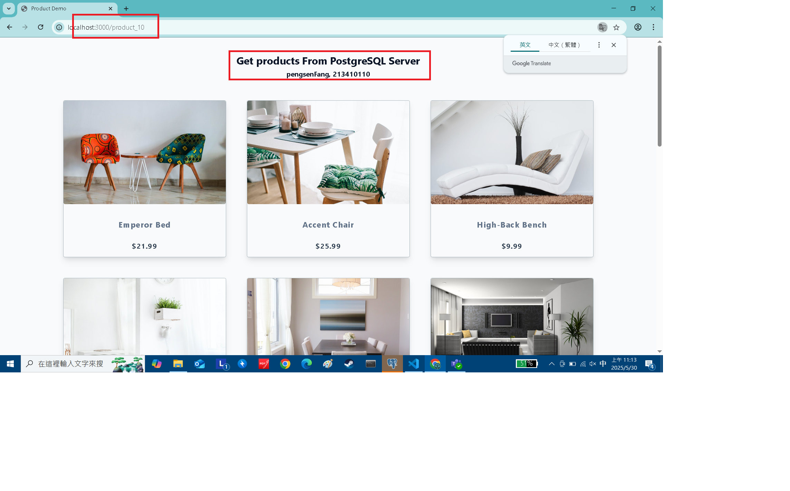
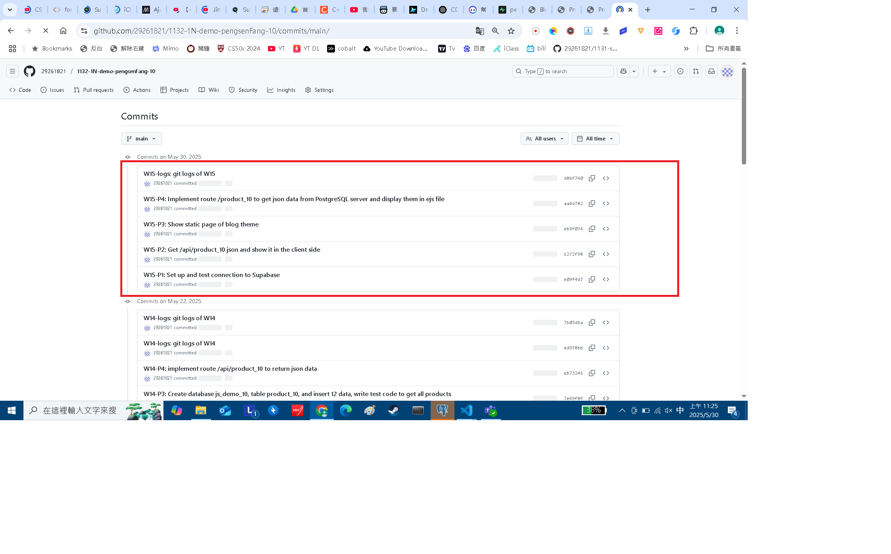

[Github URL](https://github.com/29261821/1132-1N-demo-pengsenFang-10)

[vercel URL](https://1132-1n-demo-pengsenfang-10.vercel.app/)

### W15-P1: Set up and test connection to Supabase

#### => add support for .env in package.json



#### => Connection setting to Supabase



#### => For route /api/product_10, get json from Supabase



```
e09f4d7 29261821        Fri May 30 11:17:44 2025 +0800  W15-P1: Set up and test connection to Supabase
```

### W15-P2: Get /api/product_10 json and show it in the client side

#### =>



```
c272f98 29261821        Fri May 30 11:19:13 2025 +0800  W15-P2: Get /api/product_10 json and show it in the client side
```

### W15-P3: Show static page of blog theme




```
eb9f074 29261821        Fri May 30 11:19:43 2025 +0800  W15-P3: Show static page of blog theme
```

### W15-P4: Implement route /product_10 to get json data from PostgreSQL server and display them in ejs file

#### => related code



#### => Chrome



```
98e9fe5 htchung Thu May 29 20:56:25 2025 +0800  W15-P4: Implement route /product_xx to get json data from PostgreSQL server and display them in ejs file
```

### W15-logs: git logs of W15



```
ed978bb 29261821        Thu May 22 21:37:28 2025 +0800  W14-logs: git logs of W14
```
